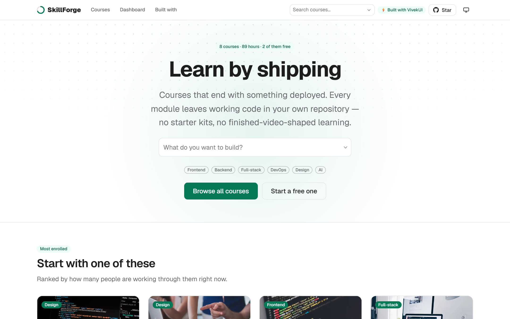

<div align="center">



# SkillForge

**A free, open-source course marketplace and LMS template for Next.js 16.**

Built entirely with [VivekUI](https://ui.vivekkumarsingh.in) — 91 React components and
6 SVG charts, **zero runtime dependencies**.
No Tailwind, no shadcn, no MUI, no CSS-in-JS.

[**Live demo**](https://skillforge.vivekkumarsingh.in) ·
[**Component library**](https://ui.vivekkumarsingh.in) ·
[**Colophon**](https://skillforge.vivekkumarsingh.in/built-with)

[](https://nextjs.org)
[](https://react.dev)
[](https://www.typescriptlang.org)
[](https://www.npmjs.com/package/@the_viveksingh/vivek-ui)
[](#zero-runtime-dependencies)
[](./LICENSE)
[](https://github.com/intellectwithvivek/SkillForge)

</div>

---

## Quick start

Requires **Node.js 20.9+** (22 LTS recommended).

```bash
git clone https://github.com/intellectwithvivek/SkillForge.git
cd SkillForge
npm install
npm run dev
```

Open <http://localhost:3000>.

| Script | What it does |
|---|---|
| `npm run dev` | Development server (Turbopack) |
| `npm run build` | Production build — all 8 course pages prerender |
| `npm start` | Serve the production build |
| `npm run lint` | ESLint |

## Deploy

[](https://vercel.com/new/clone?repository-url=https%3A%2F%2Fgithub.com%2Fintellectwithvivek%2FSkillForge&project-name=skillforge&repository-name=skillforge)

One thing to change before you ship: set `SITE.url` in [`lib/site.ts`](./lib/site.ts) to
your own domain. It is the `metadataBase` behind every canonical URL, Open Graph tag,
sitemap entry and JSON-LD `@id`, so nothing else needs touching.

There are no environment variables and no external services. It builds and runs as-is.

---

## What's in it

| Route | What it demonstrates |
|---|---|
| **`/`** | Hero with course search · featured grid · stats with animated counters · a how-it-works Stepper · instructor spotlight with a credential Timeline · testimonials · pricing with a yearly toggle · FAQ · newsletter |
| **`/courses`** | Live category, level, price and rating filters · pagination · empty state. Cards are server-rendered and handed to the client filter as elements, so the browser gets the predicate, not the markup |
| **`/courses/[slug]`** | Preview player in a modal · sticky enrol panel · "what you'll learn" · a content-mix donut · nested curriculum accordion · instructor timeline · review distribution · related courses |
| **`/dashboard`** | Completion rings per course · an eight-week learning-minutes line chart · a thirty-day streak sparkline · certificates empty state |
| **`/built-with`** | Every section of the site mapped to the component that renders it, deep-linked to its docs |

### The signature element

Every bullet glyph on the site is a thin `ProgressRing` — the same chart primitive that
reports 72% on a dashboard card, shrunk to punctuation. One idea applied everywhere:
this is a site about degrees of progress.

### Charts

All six ship in the same package at a second import path, as inline SVG with no charting
dependency. Each renders a visually hidden `<table>` so a screen reader gets the numbers
rather than "graphic".

| Chart | Where |
|---|---|
| `ProgressRing` | Completion on every enrolled card — and every bullet on the site |
| `PieChart` | The "what's inside" content mix on each course page |
| `LineChart` | Learning minutes over the last eight weeks |
| `Sparkline` | The thirty-day streak beside the counter |

---

## Making it yours

Everything that is not layout lives in four files.

| File | What it controls |
|---|---|
| [`data/courses.ts`](./data/courses.ts) | The eight courses: curriculum, lessons, ratings, reviews, instructors |
| [`data/learner.ts`](./data/learner.ts) | The dashboard: enrolments, weekly minutes, daily streak |
| [`data/faq.ts`](./data/faq.ts) | The FAQ — one array feeding both the visible copy and the schema |
| [`lib/site.ts`](./lib/site.ts) | Site name, URL, repository and every outbound link |

Two figures are **derived, never declared**, and it is worth keeping them that way:

- The **content mix** on each course page is summed from the lesson list, so the donut
  and the curriculum below it cannot disagree.
- The **star average** is computed from the rating distribution, so the headline figure
  and the bars cannot drift apart.

### Theming

The Emerald accent is a handful of CSS custom properties at the top of
[`app/globals.css`](./app/globals.css). Change them and the whole library follows —
buttons, badges, focus rings, chart series:

```css
:root {
  --vk-color-primary: #047857;
  --vk-color-primary-hover: #036049;
  --vk-color-ring: #059669;
  --vk-chart-1: #047857;
  /* … */
}
```

Every VivekUI selector is wrapped in `:where()` — specificity zero — so a single flat
class of your own always wins. **There is no `!important` anywhere in this project.**

---

## SEO and AEO

Search and answer-engine coverage is complete rather than decorative:

- **Metadata API per route** with `metadataBase`, canonical URLs, Open Graph and Twitter cards
- **Generated share images** — [`app/opengraph-image.tsx`](./app/opengraph-image.tsx) for
  the site and one per course, rendered at build time with `next/og` so the figures on
  them can never go stale
- **[`app/sitemap.ts`](./app/sitemap.ts)** with per-course `lastModified` and image entries
- **[`app/robots.ts`](./app/robots.ts)** and **[`app/manifest.ts`](./app/manifest.ts)**
- **JSON-LD**: `Course` + `hasCourseInstance` + `AggregateRating` on every course page ·
  `ItemList` on the catalogue · `BreadcrumbList` on every nested route · `FAQPage` on the
  homepage · `EducationalOrganization` and `WebSite` site-wide
- **Exactly one `<h1>` per page**, server components preferred throughout
- **[`public/llms.txt`](./public/llms.txt)** for answer engines

The FAQ copy and the `FAQPage` schema are generated from
[one array](./data/faq.ts) — a crawler can never read a different answer from a visitor.

## Accessibility

- Skip link as the first tab stop on every page
- One `<h1>` per page and a gap-free heading outline
- Colour contrast **checked, not assumed**: every foreground/background pair in the
  palette clears WCAG AA at 4.5:1 or better (the accent carries white text at 5.48:1 in
  light mode, 10.29:1 in dark)
- The review distribution is a real `<dl>`, so each bar is announced with its star level
- Charts render a visually hidden data table, so the numbers reach assistive tech
- `prefers-reduced-motion` respected throughout
- Card links are stretched with a pseudo-element rather than wrapping the whole card, so
  the accessible name stays the course title

Verified in a real browser at 360px, 375px, 768px, 1024px, 1280px and 1440px: no console
errors, no horizontal overflow, every tab stop shows a focus indicator.

---

## Zero runtime dependencies

```bash
npm ls --omit=dev
```

```
skillforge@0.1.0
├── @the_viveksingh/vivek-ui@0.5.0
├── next@16.3.2
├── react@19.2.8
└── react-dom@19.2.8
```

That is the whole tree. `@the_viveksingh/vivek-ui` brings **91 components and 6 charts**
for 47.6 kB brotlied, with React excluded and nothing else pulled in behind it.

## Powered by VivekUI

**91 React components · 6 SVG charts · zero runtime dependencies.** One install, one CSS
import, no config.

```bash
npm i @the_viveksingh/vivek-ui
```

[Documentation](https://ui.vivekkumarsingh.in/docs?utm_source=vivekui-template&utm_campaign=lms&utm_medium=readme) ·
[Components](https://ui.vivekkumarsingh.in/docs/components?utm_source=vivekui-template&utm_campaign=lms&utm_medium=readme) ·
[Charts](https://ui.vivekkumarsingh.in/docs/charts?utm_source=vivekui-template&utm_campaign=lms&utm_medium=readme) ·
[npm](https://www.npmjs.com/package/@the_viveksingh/vivek-ui) ·
[GitHub](https://github.com/intellectwithvivek/vivek_UI)

### Components used here

<details>
<summary><strong>48 components and 4 charts</strong> — click to expand</summary>

<br>

`Accordion` · `Alert` · `AnimatedCounter` · `AspectRatio` · `Avatar` · `Badge` ·
`Breadcrumb` · `Button` · `Card` · `Code` · `Combobox` · `Container` · `CopyButton` ·
`Divider` · `EmptyState` · `FAQ` · `FeatureGrid` · `Field` · `Flex` · `Footer` · `Grid` ·
`Heading` · `IconButton` · `Modal` · `Navbar` · `Newsletter` · `Pagination` · `Pricing` ·
`Progress` · `Prose` · `Rating` · `RelativeTime` · `Section` · `Select` · `Sidebar` ·
`Slider` · `Stack` · `Stats` · `Stepper` · `Switch` · `Table` · `Testimonials` · `Text` ·
`ThemeProvider` · `ThemeToggle` · `themeScript` · `Timeline` · `Toast`

**Charts:** `ProgressRing` · `PieChart` · `LineChart` · `Sparkline`

Every one is mapped to the section it renders, and deep-linked to its docs, on
[`/built-with`](https://skillforge.vivekkumarsingh.in/built-with).

</details>

---

## Contributing

Issues and pull requests are welcome — bug reports especially.
[Open an issue](https://github.com/intellectwithvivek/SkillForge/issues).

## Licence

[MIT](./LICENSE) © 2026 [Vivek Kumar Singh](https://vivekkumarsingh.in/). Free for any
use, commercial included.

The "Built with VivekUI" credit in the footer is **removable** — it is a template, not a
licence condition. If you keep it, or [star the repository](https://github.com/intellectwithvivek/SkillForge),
that is appreciated.
